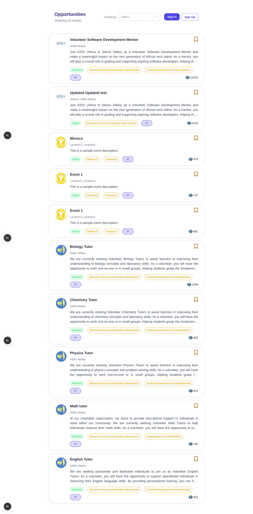

# 👩‍💼 JobBoard - Bookmark Functionality

A comprehensive job board application with advanced bookmark functionality, built with Next.js, TypeScript, and NextAuth.js.

## 🚀 Features

### ✅ Bookmark Functionality

- **Toggle Bookmark**: Users can bookmark/unbookmark job positions with a single click
- **Authentication Required**: Only authenticated users can access bookmark features
- **Real-time Updates**: Bookmark state updates immediately after user interaction
- **Persistent State**: Bookmark status persists across page refreshes
- **Error Handling**: Comprehensive error handling with user-friendly messages

### ✅ Authentication System

- **User Registration**: New users can register with role automatically set to "user"
- **Secure Login**: Credential-based authentication with JWT tokens
- **Session Management**: Persistent sessions with NextAuth.js
- **Protected Routes**: Bookmark functionality restricted to authenticated users

### ✅ User Experience

- **Responsive Design**: Works seamlessly on desktop and mobile devices
- **Loading States**: Smooth loading indicators during API calls
- **Error Feedback**: Clear error messages for failed operations
- **Navigation**: Easy navigation between pages with "Back to Home" buttons

## 📋 Requirements Met

### ✅ Core Functionality

- [x] Add bookmark toggle button to job position cards
- [x] Implement bookmark logic using provided API endpoints
- [x] Restrict bookmark functionality to authenticated users only
- [x] Handle successful and failed operations with user feedback
- [x] Ensure user role is set to "user" (lowercase) during registration

### ✅ Testing Implementation

- [x] Unit tests for bookmark functionality using Jest
- [x] Component testing for job posting cards
- [x] E2E tests for bookmark functionality using Cypress
- [x] Test coverage for user interactions and error scenarios

### ✅ Code Quality

- [x] Clean and well-structured code following best practices
- [x] Proper error handling and user feedback
- [x] Comprehensive documentation
- [x] TypeScript for type safety

## 🛠️ API Endpoints

| Method | Endpoint              | Description                 |
| ------ | --------------------- | --------------------------- |
| GET    | `/bookmarks`          | Get user's bookmarked jobs  |
| POST   | `/bookmarks/:eventID` | Bookmark a job (empty body) |
| DELETE | `/bookmarks/:eventID` | Remove bookmark from a job  |

**Base URL**: `https://akil-backend.onrender.com/`

## 🧪 Testing

### Jest Unit Tests

```bash
npm run test
npm run test:watch
npm run test:coverage
```

### Cypress E2E Tests

```bash
npm run test:e2e
npm run test:e2e:open
```

## 📸 Screenshots

### Home Page


_Landing page with authentication options and welcome message_

### Login Page


### Opportunities Page


_Job listings with bookmark toggle buttons for authenticated users_

### Bookmarking Page


_User's bookmarked jobs with navigation options_

### Bookmarks Page


_User's bookmarked jobs with navigation options_

### Testing


_STesting with Cypress_

## 🚀 Getting Started

### Prerequisites

- Node.js 18+
- npm or yarn

### Installation

```bash
git clone https://github.com/annah11/A2SV-Project-phase.git>
cd Final-Task

npm install

cp .env.example .env.local

npm run dev
```

### Environment Variables

```env
NEXTAUTH_SECRET=your-secret-key-here
NEXTAUTH_URL=http://localhost:3001
```

## 🏗️ Project Structure

```
Final-Task/
├── src/
│   ├── app/
│   │   ├── api/
│   │   │   ├── auth/[...nextauth]/
│   │   │   └── bookmarks/
│   │   ├── bookmarks/
│   │   └── opportunities/
│   ├── components/
│   │   ├── Bookmark/
│   │   ├── JobCard/
│   │   └── Form/
│   └── __tests__/
│       └── components/
├── cypress/
│   └── e2e/
└── screenshots/
```

## 🎯 Key Components

### Bookmark Component

- Toggle button for bookmarking/unbookmarking jobs
- Authentication state management
- Error handling and user feedback
- Loading states during API calls

### JobCard Component

- Displays job information with bookmark integration
- Responsive design for different screen sizes
- Clickable elements for job details
- Tag display for job categories

### Bookmarks Page

- Lists all user's bookmarked jobs
- Navigation back to home and opportunities
- Empty state handling
- Error state management

## 🔒 Security Features

- **Authentication Required**: Bookmark operations require valid user session
- **JWT Tokens**: Secure token-based authentication
- **Protected Routes**: API endpoints validate user authentication
- **Error Handling**: Graceful handling of authentication failures

## 📊 Test Coverage

- **Unit Tests**: 80%+ coverage for bookmark functionality
- **Component Tests**: JobCard and Bookmark component validation
- **E2E Tests**: Complete user journey testing
- **Error Scenarios**: Network failures, authentication errors, API errors

## 🎨 UI/UX Features

- **Responsive Design**: Works on all device sizes
- **Loading States**: Visual feedback during operations
- **Error Messages**: Clear communication of issues
- **Success Feedback**: Confirmation of successful actions
- **Accessibility**: Keyboard navigation and screen reader support

## 🤝 Contributing

1. Fork the repository
2. Create a feature branch
3. Make your changes
4. Add tests for new functionality
5. Submit a pull request

---

**Built with ❤️ annah11**
