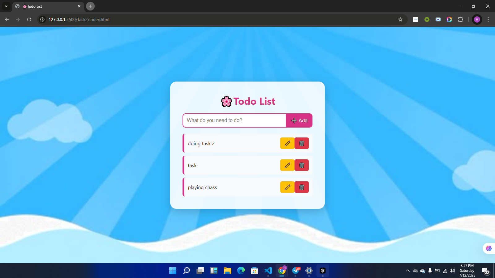
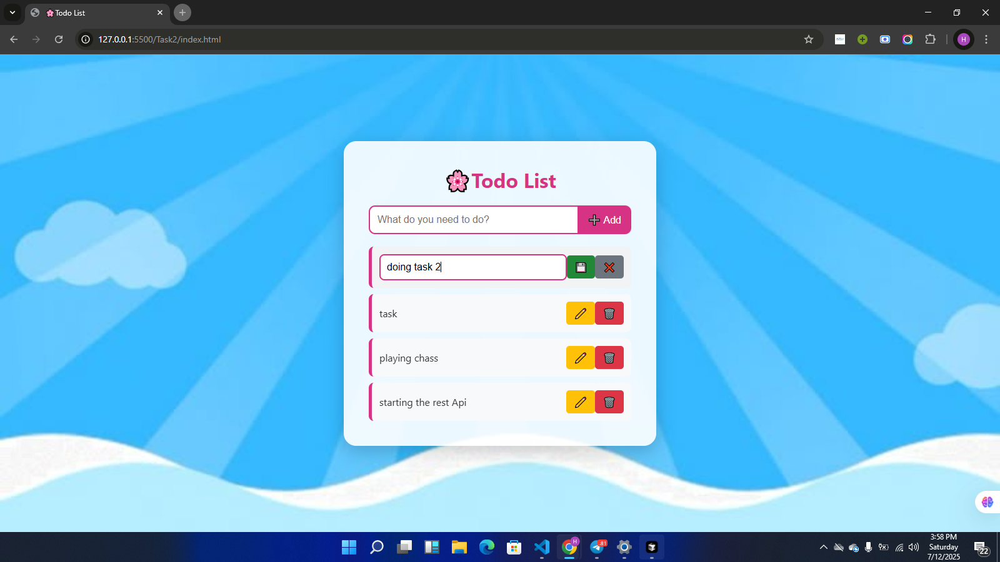
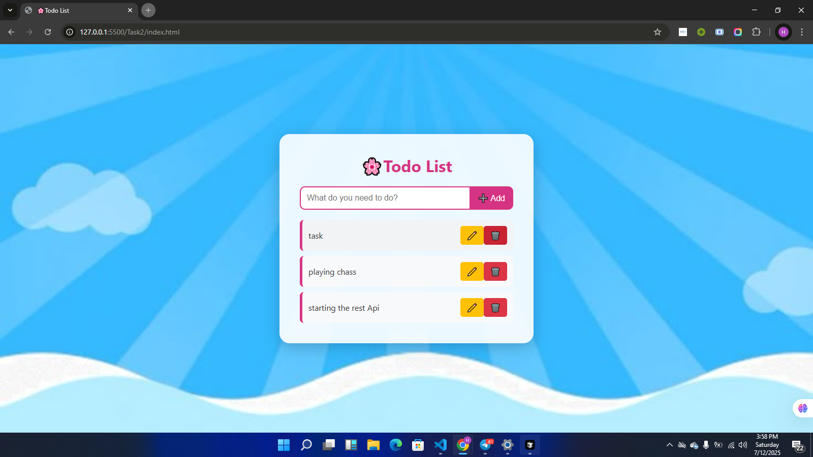

# 🌸 Anime-Styled TypeScript Todo List App

A modern, beautifully designed **To-Do List App** built with **TypeScript, HTML, and CSS**, featuring an elegant anime-inspired interface. Manage your daily tasks with inline editing, local saving, and a calming animated design.

---

## ✨ Features

- ✅ Add new tasks
- 📝 Edit tasks inline (without popups)
- ✅ Double-click to mark tasks as done
- 🗑️ Delete tasks
- 💾 Auto-save using `localStorage`
- 🎨 Stunning anime background & glass-style UI
- 🧠 Beginner-friendly code using TypeScript
- 💻 Clean folder structure

---

## 🧪 Preview
### Adding a Task

### edit a Task

### Adding a Task

## 📁 Folder Structure

---

## 🚀 How to Run the App

### 🧱 Requirements

- A modern browser (Chrome, Firefox, Edge)
- [Node.js & TypeScript](https://www.typescriptlang.org/download) installed (if editing `.ts`)

### 🧰 Steps

1. **Download or clone the project**  

2. **Compile the TypeScript file**  
(Only if you edit the `app.ts`)

3. **Open `index.html` in your browser**

## 📌 Technologies Used

- **TypeScript** – for structured, type-safe JS
- **HTML5** – layout and semantic structure
- **CSS3** – anime-style UI and animations
- **LocalStorage** – to store tasks between refreshes

---

## 🧠 Learning Goals

This project helps you practice:

- DOM manipulation in TypeScript
- Handling user input
- Event listeners & double-click logic
- Saving and retrieving data from `localStorage`
- Using flexbox and modern CSS styling

---

## 👩‍💻 Author

Made with love 💖 by **Hana**  
---

