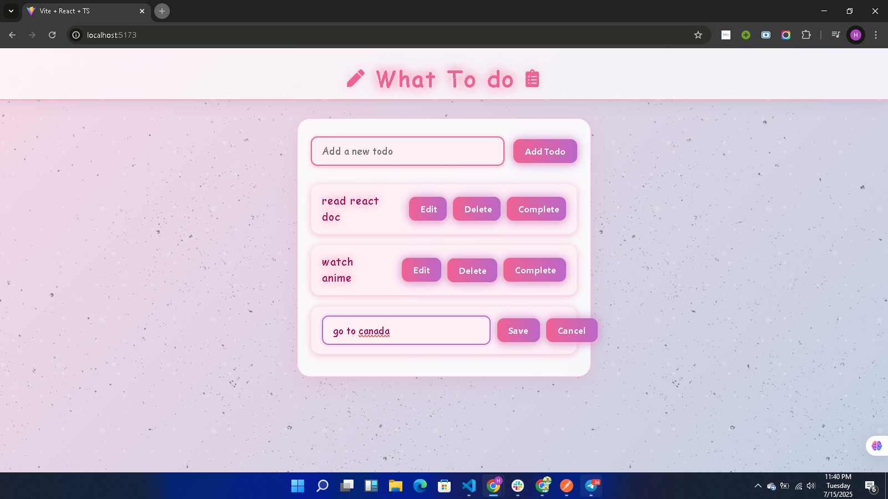
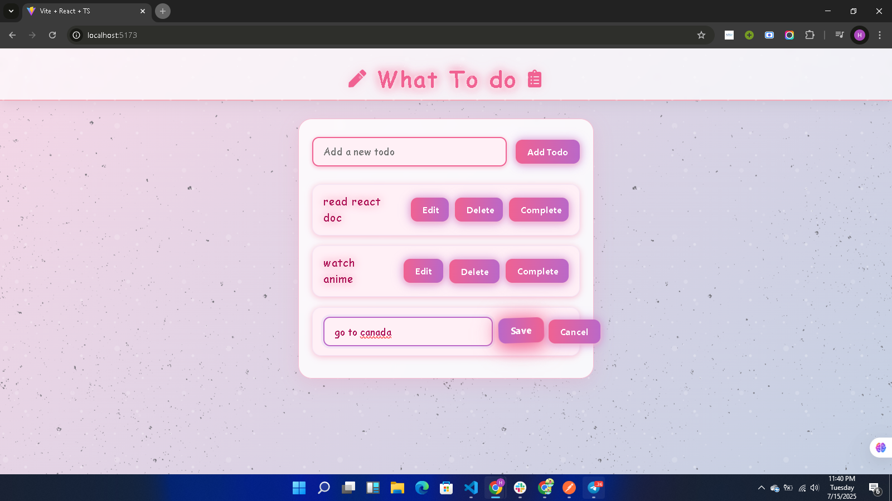
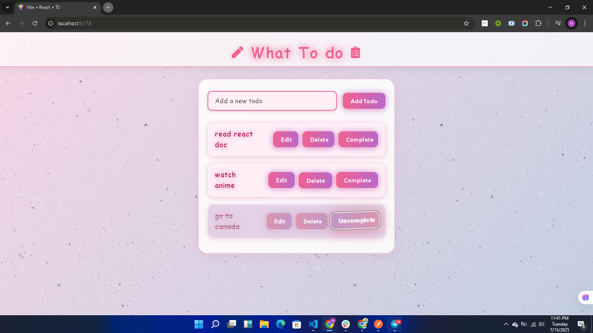
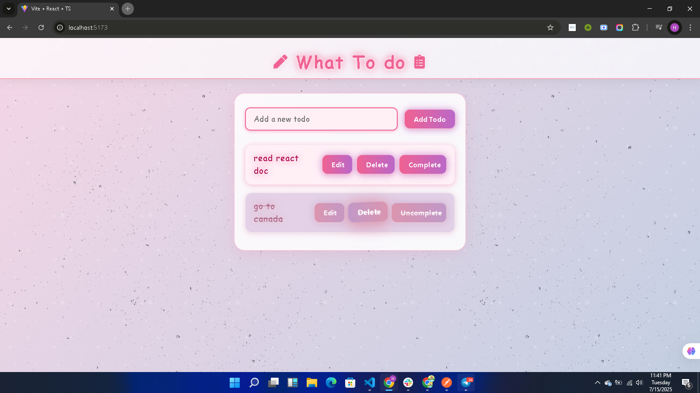

# Anime-Inspired ToDo List App


## ✨ Features
- Add, edit, complete, and delete todos
- Smooth animations and glowing effects
- Data persists in your browser (localStorage)
- Responsive and mobile-friendly

## 🚀 Getting Started

1. **Install dependencies:**
    First, open your terminal and run:
    ```git clone https://github.com/annah11/A2SV-Project-phase.git```
    
   ```sh
   cd anime-todo
   npm install
   ```
2. **Start the development server:**
   ```sh
   npm run dev
   ```
3. **Open your browser:**
   Visit [http://localhost:5173](http://localhost:5173) (or the URL shown in your terminal)

## 🖼️ 
### Main screen

### editing a Task


### Task saved


### Done a Task


### Deleting a Task



## 🛠️ Tech Stack
- [React](https://react.dev/)
- [TypeScript](https://www.typescriptlang.org/)
- [Vite](https://vitejs.dev/)
- [react-icons](https://react-icons.github.io/react-icons/)


---

