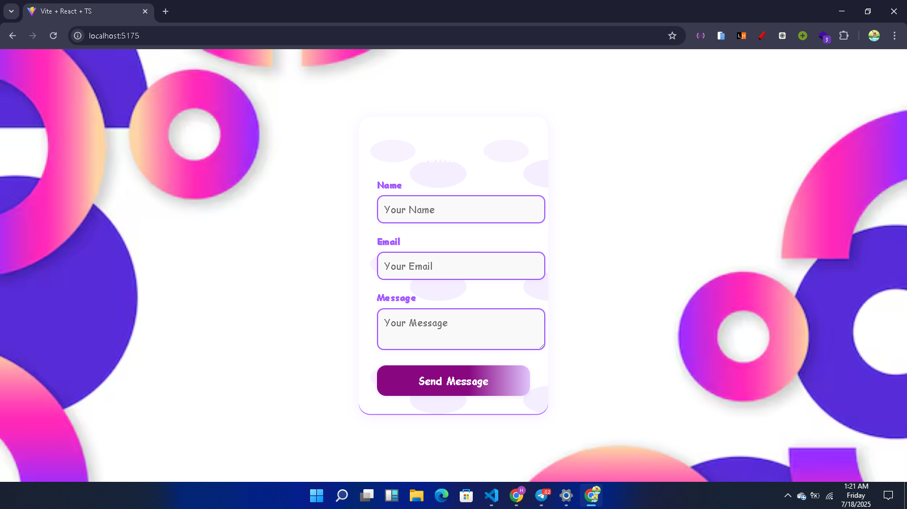
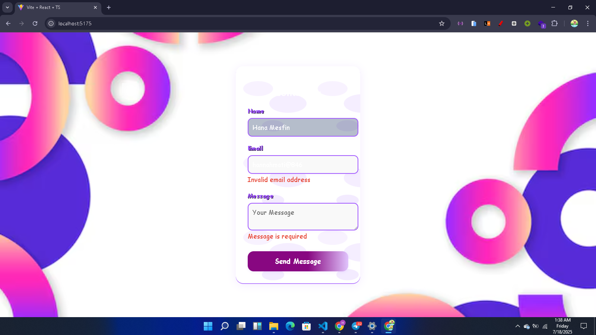
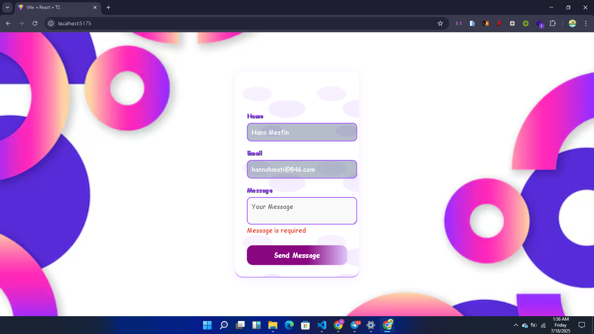
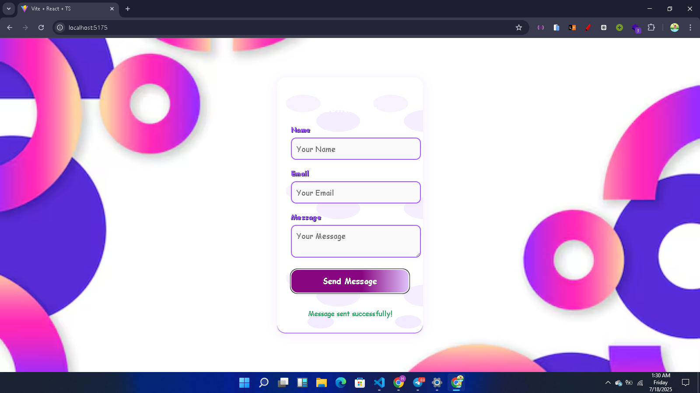

# Contact Form React App

This project is a simple and responsive Contact Form built with React and TypeScript, utilizing the `useForm` hook from `react-hook-form` for form state management and validation.

## Features
- **Name, Email, and Message fields**
- **Form validation** for required fields and valid email format
- **Error messages** for invalid inputs
- **Responsive and clean UI**
- **Form state management** using `useForm`

## How to Use
1. Install dependencies:
   ```bash
   npm install
   ```
2. Start the development server:
   ```bash
   npm run dev
   ```
3. Open your browser and go to `http://localhost:5173` (or the port shown in your terminal).

## Technologies Used
- React
- TypeScript
- react-hook-form
- Vite
- CSS

## Project Structure
- `src/ContactForm.tsx`: Main Contact Form component
- `src/ContactForm.css`: Styles for the Contact Form
- `src/App.tsx`: App entry point rendering the Contact Form

## Screenshots


## Name Req


## Invalid Email


## Message Req


## Succesfull

---

Made by 'Hannah'