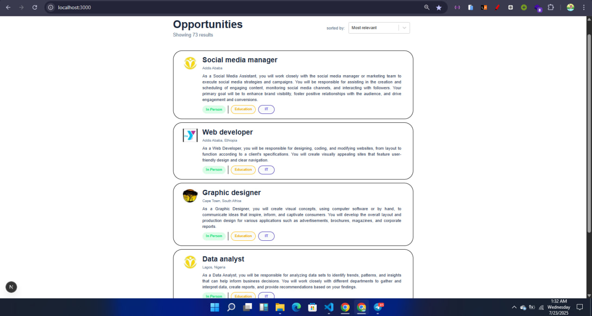
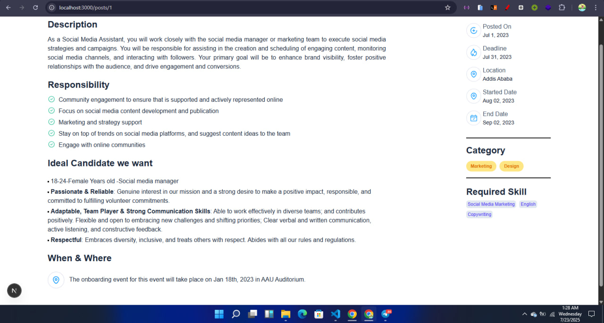

#  👩‍💼  Job Listing Dashboard

A responsive **Job Listing Dashboard** built using **Next.js (App Router)** and **Tailwind CSS**.

This project was developed based on a Figma design provided for task implementation and uses a local `JSON` file as dummy job data.

## 🖌️ Styling

- **Tailwind CSS** is used for styling with semantic utility classes only.
- Components like `JobCard`, `Button`, and `Skill` are styled to match the provided Figma design.
- Responsive design using flex/grid and mobile-first breakpoints.
- Button components use custom background and text colors for clarity.

## 🔧 How It Works

- Job data is loaded from `app/data/jobs.json`.
- The dashboard dynamically renders all job postings.
- Each job is shown in a reusable `JobCard` component, displaying:
  - Company logo
  - Job title
  - Company name
  - Description
  - Location
  - Job type

## 🚀 Getting Started

### 1. Clone the repo

```bash
git clone https://github.com/annah11/A2SV-Project-phase.
cd A2SV-Project-phase/Task6
```

### 2. Install dependencies

```bash
npm install
```

### 3. Run the dev server

```bash
npm run dev
```

Then open `http://localhost:3000` in your browser.

## 📸 Screenshots

### Home



### Detail


## 📦 Technologies Used

- [Next.js 14 (App Router)](https://nextjs.org/docs/app)
- [React](https://reactjs.org/)
- [Tailwind CSS](https://tailwindcss.com/)
- [TypeScript](https://www.typescriptlang.org/)

---

## 📬 Author

**👤 Annah11**  
GitHub: [@annah11](https://github.com/annah11)

