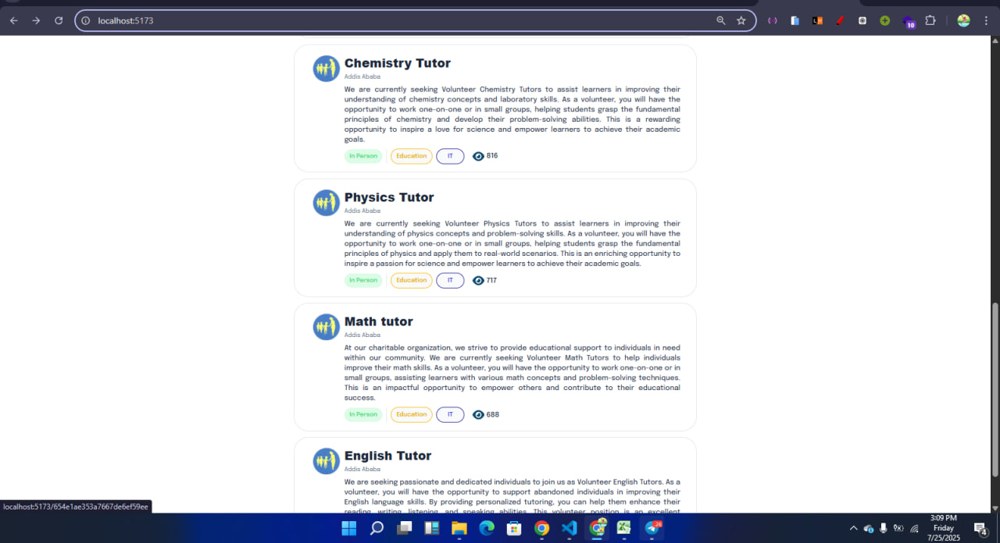
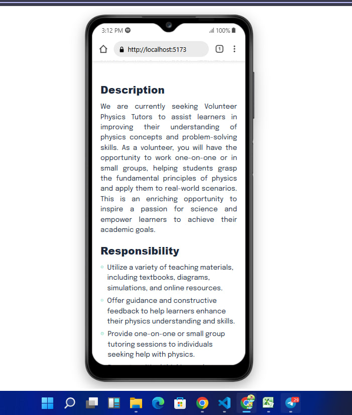
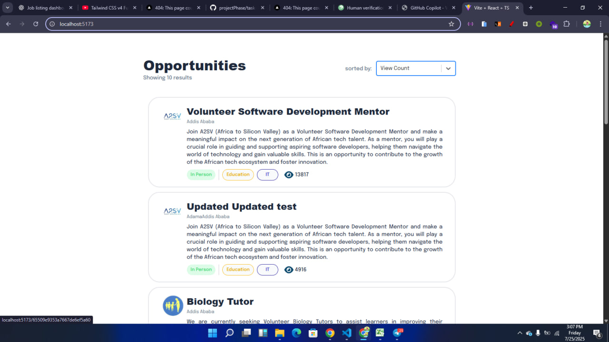
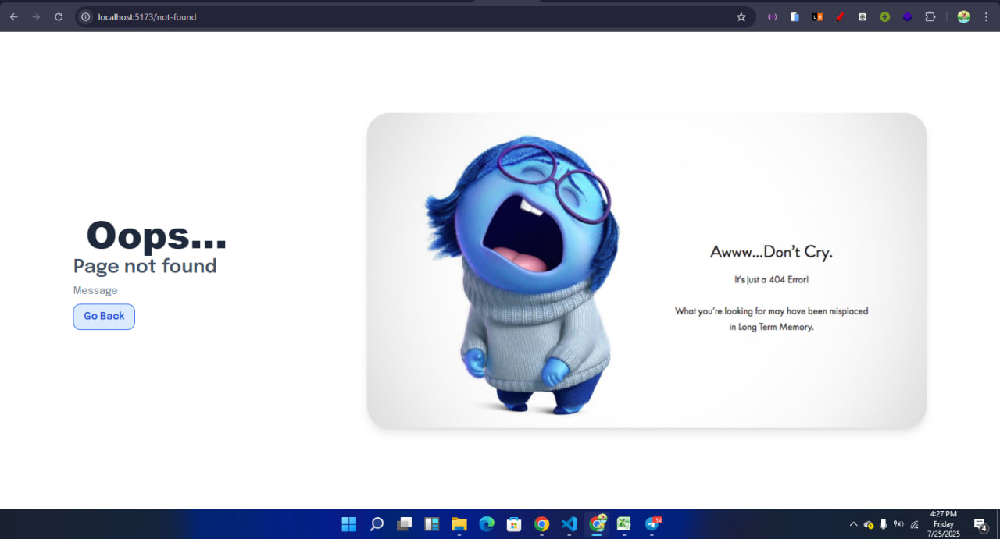

# Job Posting Cards and Dashboard using React

This project implements a job posting dashboard using **React**, **Next.js (App Router)**, **Tailwind CSS**, and **TypeScript**. It is structured using reusable components and integrates data fetching from a backend API using **Redux Toolkit Query**. The app includes a loading skeleton and supports responsiveness for all screen sizes.

---

### 📁 Table of Contents

* [🚀 Features](#-features)
* [🛠️ Installation](#️-installation)
* [📆 Usage](#-usage)
* [🧹 Components](#-components)
* [📡 Redux Toolkit Query](#-redux-toolkit-query)
* [🖼️ Screenshots](#-screenshots)
* [👩 Author](#-author)

---

### 🚀 Features

* Display job postings in reusable cards
* Detail page for each opportunity
* Integrated API from backend using Redux Toolkit Query
* Skeleton loaders for UX while data is loading
* Graceful 404 page for not found routes
* Fully responsive design (mobile-first)

---

### 🛠️ Installation

1. **Clone the repository:**

   ```bash
   git clone https://github.com/annah11/A2SV-Project-phase.git
   cd Task7
   ```

2. **Install dependencies:**

   ```bash
   npm install
   ```

3. **Run the development server:**

   ```bash
   npm run dev
   ```

   Open [http://localhost:5173](http://localhost:5173) in your browser.

---

### 📆 Usage

Once running, the application fetches data from the backend and displays it in card format. Click any card to view more detailed information about the job opportunity.

---

### 🧹 Components

The key components located in `src/components/` include:

* `JobCard`: Displays individual job posting
* `JobList`: Loops and displays job cards
* `MainPageSkeleton`: Skeleton UI shown during loading
* `Header`: App header/navigation
* `SelectSortedBy`: Sort dropdown
* `About` & `Detail`: Shown on job detail page
* `Skill`, `Button`, `Date`: UI elements
* `NotFound`: Custom 404 page

---

### 📡 Redux Toolkit Query

The app uses RTK Query to fetch and cache API data from:

```
https://akil-backend.onrender.com/opportunities/search
```

Handled via `src/features/api`.

---

### 🖼️ Screenshots

Screenshots are stored in the `public/img` folder.

#### 🧱 Skeleton of landing page


#### 🏠 Landing page



#### 🧱 Skeleton of detail page



#### 📋 view count 



#### ❌ Not found page



#### 📱 Responsive on mobile


---

### 👩 Author

**Annah11**
GitHub: [@annah11](https://github.com/annah11)
