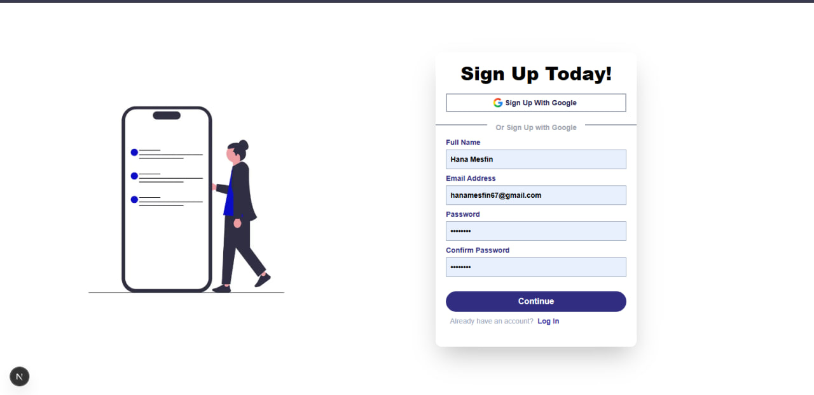
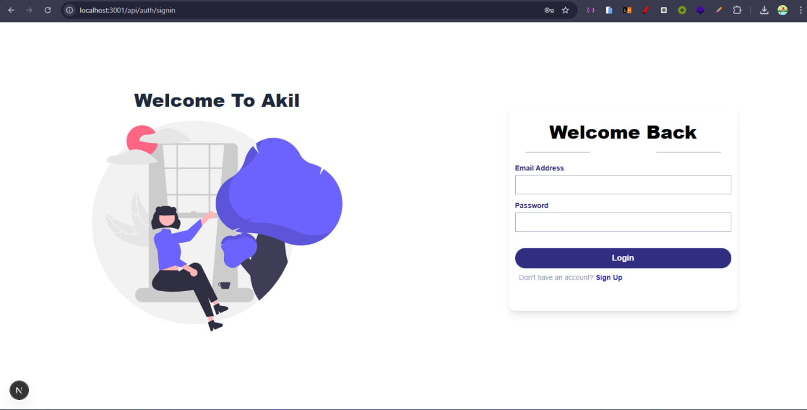
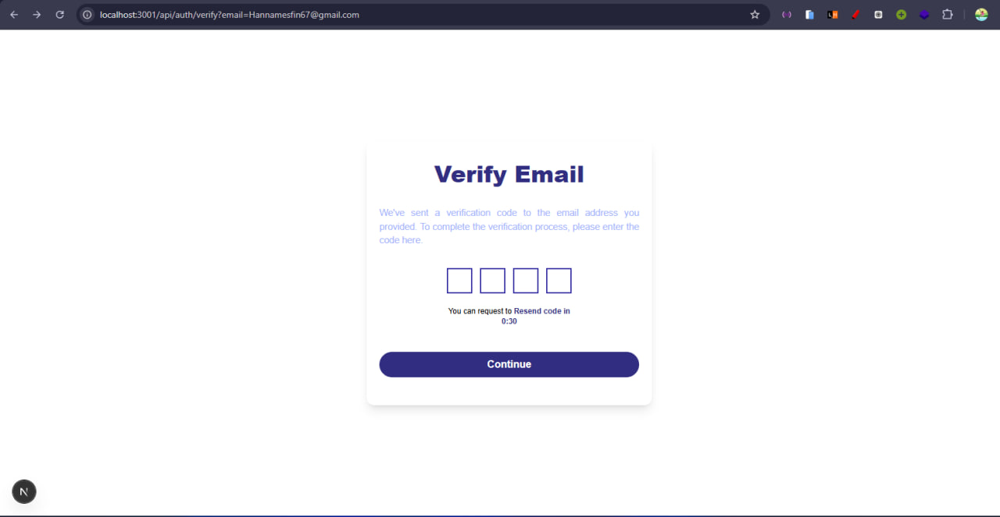

# 🔐 Task 8 – NextAuth Authentication for Akil Platform

This project adds secure user authentication to the **Akil platform** using **Next.js App Router**, **NextAuth.js**, **TypeScript**, and **Tailwind CSS**. It features a custom login form, JWT-based session handling, Google login integration, and secure redirection after sign-in. Form validation is powered by **React Hook Form** and **Zod**.

---

## 📁 Table of Contents

- [🚀 Features](#-features)
- [🛠️ Installation](#️-installation)
- [🔑 Environment Variables](#-environment-variables)
- [📆 Usage](#-usage)
- [📂 Project Structure](#-project-structure)
- [🔐 Auth Flow Overview](#-auth-flow-overview)
- [🖼️ Screenshots](#-screenshots)
- [👩 Author](#-author)

---

## 🚀 Features

- ✅ **Custom login page** with form validation
- 🔐 **NextAuth.js** integration (Credentials + Google)
- 🔁 **JWT**-based token/session handling
- 🔄 Automatic **token refresh**
- 🔒 Protected pages via `useSession()`
- 🧾 Error toast feedback using `react-toastify`
- 💅 Fully styled using **Tailwind CSS**
- 🌐 Responsive across screen sizes

---

## 🛠️ Installation

1. **Clone the repository:**

```bash
git clone https://github.com/annah11/A2SV-Project-phase.git
cd Task8


2. **Install dependencies:**

   ```bash
   npm install
   ```

3. **Run the development server:**

   ```bash
   npm run dev
   ```

   Open [http://localhost:3001](http://localhost:3001) in your browser.

---

### 📆 Usage

Go to /login to access the custom login form.

Enter valid credentials (email + password).

If successful, the user is redirected to /posts.

If tokens expire, the app automatically refreshes them using the backend's /refresh endpoint.
### 🛡️ Authentication Flow
signIn('credentials') sends email/password to the backend.

Backend responds with accessToken, refreshToken, and expiry.

Tokens are saved to the NextAuth JWT.

Access tokens are refreshed silently before expiry via the backend.

Session info is available via useSession().

---


### 🖼️ Screenshots

Screenshots are stored in the `public/asset` folder.

#### 🧱 signup page



#### 🏠 login page



#### 🧱 verify page



---

### 👩 Author

**Annah11**
GitHub: [@annah11](https://github.com/annah11)
